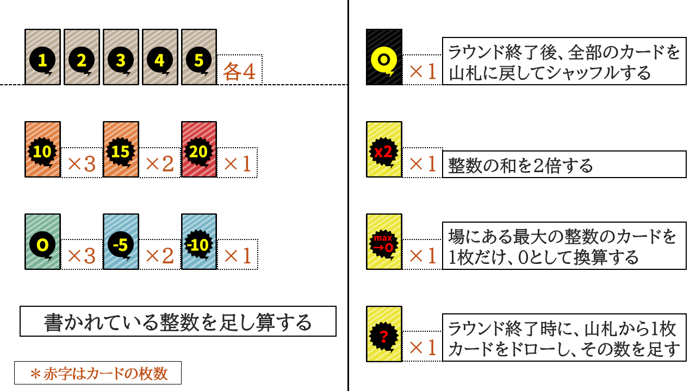

# 開催概要


## 目次
- [開催概要](#開催概要)
  - [目次](#目次)
  - [運営委員メンバー](#運営委員メンバー)
    - [実行委員](#実行委員)
    - [スペシャルスポンサー](#スペシャルスポンサー)
    - [協賛団体](#協賛団体)
- [コヨーテルールブック](#コヨーテルールブック)
- [大会ルール（AIに対するルール）](#大会ルールaiに対するルール)
    - [開発のルール](#開発のルール)
    - [秘匿ファイルがある方へ](#秘匿ファイルがある方へ)
- [開発環境について](#開発環境について)
  - [GPUを持っていない方で機械学習やりたい方向け](#gpuを持っていない方で機械学習やりたい方向け)
  - [ローカルGPUで開発したい方向け](#ローカルgpuで開発したい方向け)
    - [導入方法](#導入方法)
    - [コンテナ](#コンテナ)
    - [Singulaityのインストール方法](#singulaityのインストール方法)
    - [プルリクの方法](#プルリクの方法)
- [提出物](#提出物)
    - [全員提出必須](#全員提出必須)
    - [対象の方のみ提出必須](#対象の方のみ提出必須)
- [賞・副賞](#賞副賞)
  - [総合部門](#総合部門)
  - [リーグ部門](#リーグ部門)
  - [一発勝負部門](#一発勝負部門)
  - [スポンサー賞](#スポンサー賞)
  - [団体賞](#団体賞)
  - [参加者賞](#参加者賞)
    - [名大祭賞](#名大祭賞)


## 運営委員メンバー

総合運営委員長  **やづや**

jack運営委員長  やづや

C0de運営委員長  あかつき

### 実行委員

鉄壁，ヌヌーピー，みな，**やづや**，バーナム , **あかつき**、ひつじ, back , 猫神

### スペシャルスポンサー

- **Kate**

### 協賛団体

-  **TAIR(東海人工知能研究会)**


# コヨーテルールブック

ゲーム開始時点で、プレイヤーはライフを3個ずつ持っています
ラウンドごとに、プレイヤーは山札から、1人1枚ずつカードをドローします
他プレイヤーのカードは見られますが、自分が引いたカードが何であるかを見ることはできません
自分のカードを含めた合計値がいくつであるかを推測してください

- ラウンドの基本の流れ
1. 最初のプレイヤーは、合計値以下であると思う自然数を宣言します
2. 次のプレイヤーが取れる行動は以下の二つのいずれかです
    1. 一つ前のプレイヤーが宣言した数字が、合計値以下であると思う場合
    …前のプレイヤーのものよりも大きく、かつ合計値以下であると思う自然数を宣言します
    2. 一つ前のプレイヤーが宣言した数字が、合計値より大きいと思う場合
    …「コヨーテ」を宣言します
3. (2-a)自然数が宣言された場合は、さらに次のプレイヤーが、2のいずれかを行います
4. (2-b)「コヨーテ」が宣言された場合
    1. 一つ前のプレイヤーが宣言した数字が、実際の合計値よりも大きい場合
    「コヨーテ」を宣言したプレイヤーが勝ち、一つ前のプレイヤーのライフが1個減少します
    2. 一つ前のプレイヤーが宣言した数字が、実際の合計値以下の場合
    一つ前のプレイヤーが勝ち、「コヨーテ」を宣言したプレイヤーのライフが1個減少します

ドローされたカードは捨て札になります

敗北したプレイヤーが、次のラウンドで最初のプレイヤーとなります

敗北したプレイヤーのライフが0個になった場合は、そのプレイヤーはゲームから脱落します

このときは、勝利したプレイヤーからラウンドが開始されます

- 残るプレイヤーが1人になるまで、ラウンドを繰り返します

- カードの枚数・効果一覧

(左が基本カード、右が特殊カード)



- 「黒背景0」を除いて、特殊カードの処理順序は「?」⇒「max→0」⇒「×2」です
- コヨーテのルールに不安がある場合は運営へ

# 大会ルール（AIに対するルール）

- 対戦は提出されたコードを運営側で実行して行います
- 3つの部門で戦績を競います
    
    **総当たり部門**
    
    - 総当たりで対戦を多数回やって、最終的な勝ち数で勝敗を決定
    - 安定した勝率が求められます
    
    **一発勝負部門**
    
    - 対戦を1回のみして、順位を決定.
    - 予選は参加者数によって対戦形式を調整、勝ち上がった二者で決勝戦を行います
    - 実況解説付き(予定)
    
    **総合部門**
    
    - 上記2つの部門の優勝者同士が、少数回対戦
    - 名大祭にて人とAIのクロスマッチを行います
    - そのために人間にもかなりの確率で勝てるAIを作り出さないといけないためかなり難しくなります。
    - 真の最強を決定します
    

### 開発のルール

- ルールベースでも機械学習でもOK、とにかく自動でコヨーテを対戦するAIを作りましょう
    - 自分の手札の情報を取得するのは禁止
    - 山札の情報を取得するのは禁止
    - かならずobservationの情報を用いてください
- 既存手法の丸パクは禁止
    - 少しでもオリジナルの要素を加えましょう
    - クライアントが行動を決定する時に使える情報は
        - プレイヤーリスト
            - プレイヤー名
            - プレイヤーID
            - 残りライフ
            - 手札
        - これまでの対戦状況
            - ターンごとの宣言したプレイヤー
            - ターンごとの宣言した数
- SingularityまたはGoogle ColabまたはPythonファイルの環境要件
    - google Colabの場合は基本的にPythonにて動作必須 ライブラリのみ追加可能（ただしPython3.12にて動作するライブラリのみ）
    - Pythonファイルの場合はPython3.12にしたうえでrequirement.txtの編集のみ可能
- 機械学習を使う場合，推論時に運営チーム側で動作させられることが必要です.
    - 推論時に下記実行環境で動作する予定です。
    - 推論時にGPUを使わないようCPUで作動するようにお願いします
    - 実行環境
        - OS ubuntu 24.04
        - CPU  ryzen 7700
        - メモリ 1024MBまで
- custom_act関数の実行時間は3秒以内
    - custom_act関数の実行時間が3秒を超えた場合は、ランダムな行動をとることになります
    - そのために、3秒以内に実行されるようにしてください
- 提出締め切り：5/17

### 秘匿ファイルがある方へ

秘匿ファイル（.envファイルなど）がある場合は運営にお問い合わせください。

ただし訓練データはそれにあたりません。

# 開発環境について

## GPUを持っていない方で機械学習やりたい方向け

Google Colabを使用してください。
Google ColabのGPUを使用する場合は、以下の手順で行ってください。Google Colabの場合は言語はPython3.12のみでライブラリも依存関係上の制約は存在します。

[Google Colab Link](https://colab.research.google.com/drive/18gTE1VECV7MRinSW2LW4iY1hVe_pPab9?usp=sharing)


## ローカルGPUで開発したい方向け

コンテナの利用には[Singularity](https://docs.sylabs.io/guides/latest/user-guide/index.html)を使用してください

なお，運営側での対戦では，Singularity 3.7.1 を使用します．

### 導入方法

Debian/Ubuntu:

https://docs.sylabs.io/guides/latest/user-guide/index.html

Mac:

https://sylabs.io/2023/03/installing-singularityce-on-macos-with-apple-silicon-using-utm-rocky/

Download an ISO Image のページのURLがおかしいので， 代わりにhttps://rockylinux.org/ja/download のDVD ISOを使う

Windows: 

Vagrant上（https://developer.hashicorp.com/vagrant/install）

または

WSL2上（ https://learn.microsoft.com/ja-jp/windows/wsl/install ）

の導入をおすすめします　

SIngularityのクイックスタートに従ってインストールしてください。

https://docs.sylabs.io/guides/latest/user-guide/quick_start.html

### コンテナ

下のURLからDLしてください．パスワードは「5410」です．

gigafile便から**coyo-te-3-12.sif**をダウンロードしてください。

[GigaFile（ギガファイル）便](https://36.gigafile.nu/0617-hf967e97e8b1b3a1fd9c36e6e095d1294)

### Singulaityのインストール方法

- Forkしたリポジトリをclone
- Singularityファイルを開く
    
    ```powershell
    singularity shell --nv --bind $HOME /path/to/**coyo-te-3-12.sif**
    ```

- 配布するシェルスクリプトを実行してください
  ```bash
    ./setup.sh
    ```
- あとは思うがままに開発してください!

## Dockerでどうしても開発したい方へ

今回のコヨーテAI大会においては、**Dockerは非推奨とさせていただいております**。

どうしてもコヨーテAI大会においてDockerが使いたい場合にはSingulaityコンテナへのビルドしたファイルをgigafile便またはDropBoxなどの各種ストレージサービスにアップロードの上運営に提出してください。

以下にDockerについてのビルド処理などについての情報を置いておきますが基本的にはご自身のレベルにあったものを使用してください。

[DockerでのディープラーニングGPU学習環境構築方法 - Qiita](https://qiita.com/karaage0703/items/e79a8ad2f57abc6872aa)
などを参考にしてください。

## 開発手順

### GItHubリンク
まず以下のGitHubのリンクをForkしてください。mainのみforkで大丈夫です。

[GithubLink](https://github.com/coyote-AI-competition/resource.git)

その後、WSL2またはSingularityのコンテナ上で以下のコマンドを実行してください。

コマンドは
```bash
source ./setup.sh
```
二回目以降でターミナル開いたときはSingularityのコンテナに入り、
```bash
source ./setup_session.sh
```
を行ってください。

### プルリクの方法

プルリクエストは、DIsCordネームまたは、チーム参加の場合はチームネームにしておいてください。

# 提出物

提出物は以下の通りです。

### 全員提出必須

**5/17までに提出**

- コヨーテ実装したファイルの入ったプルリク
- 運営がAI実装を動かすことが出来るためのREADME（最終的にはPythonファイルを実行するだけにしてください）
- requirements.txt
- プレゼンREADME

- 提出先
    1. PR (上限500MB)
    2. Gigafile便 (PRできないほど大きなファイル)
- 提出内容 Dockerを使わない
    - [半角英数字チーム名].txt (requirement.txt)
    - [半角英数字チーム名].py (実行ファイル)
    - [半角英数字チーム名]（ロジックに必要なフォルダ）
    - [半角英数字チーム名].md (read me)
        
        が含まれたフォルダ


基本的に次のような形式でディレクトリ構成で提出すること

```
client/
  |- [半角英数字チーム名].txt
  |-[半角英数字チーム名].py
  |-[半角英数字チーム名].md
  |- [半角英数字チーム名]
    |-logic.py
    |-other.py
```
[半角英数字チーム名].pyのフォルダを動かすことによってsample_arena_client.pyと同じように動くようにしてください。

**5/24までに提出**

- コヨーテ実装のPR・プレゼン動画（4分以内）
    - Google Driveなどにプレゼン動画を貼ってもらってURLで見れるようにする
    - URLで見られればなんでもOK（Youtube, google Driveなど他人が見られる形式）

### 対象の方のみ提出必須

**5/17までに提出**

- [Singularity](https://docs.sylabs.io/guides/latest/user-guide/index.html)ファイル
- 重みなどのAI学習ファイル
- .envファイルなどの秘匿ファイル

# 賞・副賞

総合優勝・準優勝・総当たり部門優勝・一発部門優勝とスポンサー賞授与された方はAward Dayにてプレゼン発表（4分以内）を行ってもらいます。最後の発表に上がれるのは最大５チーム

## 総合部門

名大祭での人とAIのクロスマッチにて勝率を計算。人間の心理も読むことが出来るか？の対戦

- 総合優勝　副賞
- 総合準優勝

## リーグ部門

コヨーテのリーグ戦で対戦を十分させる部門・リーグ戦で上位が勝ち上がれる。

対戦回数は運営により決定する

- 総当たり部門優勝　副賞
- 総当たり部門準優勝

## 一発勝負部門

総当たりで一回の対戦により上位を決める部門

- 一発勝負部門優勝　副賞
- 一発勝負部門準優勝

## スポンサー賞

PR/プレゼン動画とコードのエレガントさにより授与される。対戦結果とは関係なく与えられる賞

- KateSawada賞 副賞 (審査 kate)
- cAc運営委員長賞 副賞

## 団体賞

各団体（主催団体・協力団体）による審査する賞

- jack賞  jack側運営委員長による審査による表彰
- C0de賞  C0de側運営委員長による審査による表彰
- TAIR賞    TAIRによる審査 ML使用モデルのみ表彰

## 参加者賞

### 名大祭賞

名大祭に来てくれた参加者たちに行ってもらい、 AIに勝利した人類に対してその場で賞を授与する