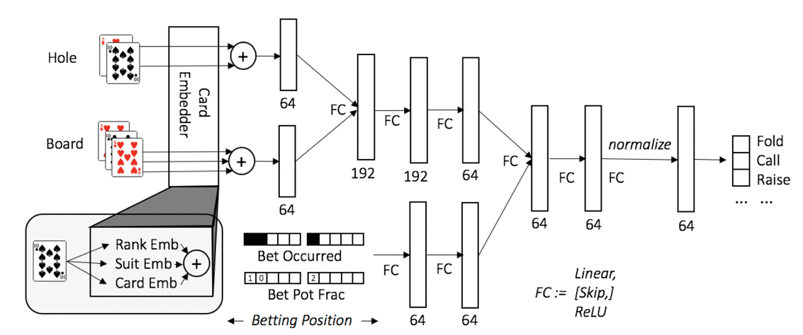

# Kuron:単純化されたコヨーテゲームに於ける深層学習を用いたモンテカルロ反実的後悔最小化近似アルゴリズム(Deep-MCFR)を使用して近似的に均衡戦略を学習した混合戦略モデル(K-agnostic Uncertain-information Regret Optimization Network)


# 概要

　本プロジェクトでは、コヨーテゲームをルール面で簡略化した環境に対して、モンテカルロ反実的後悔最小化近似アルゴリズム(Deep-MCFR)を用いた混合戦略モデルKuronを作成・評価する。また、作成したモデルを制限時間3秒以内で動作させる為にDesktop上でサーバーを立ち上げ、サーバー上で予測し結果のみを返却するシステム(Kuron on the desk)を構築する。

# はじめに
コヨーテゲームは、不完全情報の下でプレイヤー同士が互いの手札を推測し合う戦略的要素が特徴のブラフゲームである。コヨーテゲームはゲーム理論において不完全情報ゲームに分類される。似たようなゲームとしてポーカーなどが挙げられるが、ポーカーなどと違いゲーム理論を用いてナッシュ均衡となるような戦術を探索するような先行研究は存在していない。そこで、本研究ではポーカーにおいて有効な戦術を確立したアルゴリズムであるDeep-MCFRをコヨーテゲームにも適用する事によって、コヨーテゲームにおいてもDeep-MCFRが有用な手法であるかを検証し、コヨーテゲームに於ける近似的に均衡戦略を学習した混合戦略モデル(K-agnostic Uncertain-information Regret Optimization Network:Kuron)を作成する。

# Deep-MCFR
　DeepCFRは，従来のテーブルベースCFRが抱えていた状態空間や行動空間の爆発的増大によるメモリ・計算コストの課題を解決するため，深層ニューラルネットワークを用いて反事実的後悔値と平均戦略を関数近似する手法である。各イテレーションにおいては，自己対戦によるモンテカルロサンプリングを通じて得られた遷移情報から各情報集合ごとの即時後悔値を算出し，これをミニバッチとして後悔ネットワークに回帰学習させることで，状態の一般化された後悔推定器を構築する。推定された後悔値は，行動確率分布の計算（後悔マッチング）に用いられ，これらの振る舞い方を蓄積したデータをもとに平均戦略ネットワークを学習することで，漸進的に近似ナッシュ均衡へと収束させる。

このアプローチにより，高次元・連続的な情報集合をもつ大規模不完全情報ゲームに対しても，テーブルを持たずに後悔値や戦略を効率的に一般化・学習できる点が大きな特徴である。実際，ポーカーをはじめとする複雑なゲーム環境においても，従来手法と同等以上の近似均衡性能が報告されており，高速化やスケーラビリティ向上の観点からも有効性が示されている。今後は，ネットワーク構造の改良やサンプリング手法の最適化を通じて，さらに学習効率や均衡精度の向上が期待される。

本研究では，メモリ使用量を明示的に制御しつつネットワークによる後悔値近似を行う手法 Deep-MCFR を利用する。具体的には，モンテカルロサンプリングで得られる後悔値サンプルを逐次メモリに蓄積し，容量を超えた際には古いサンプルをランダムに削除することで定常的なメモリ使用に抑制しつつ，ニューラルネットワークで後悔値関数を学習・近似する。


*ポーカーに於けるDeepCFRのアーキテクチャ

# コヨーテゲームの単純化

　Deep-MCFRを用いてコヨーテゲームを学習するに当たって一ゲームあたりの膨大なターン数が問題となる。DeepMCFRは後悔値の学習時、そのゲーム中に取り得た全選択を他プレイヤーの行動をモンテカルロ法で予測しながら検証して後悔値を算出する。これは取り得る選択肢数nが一定である場合平均ターン数mを用いて一ゲームあたりO(n^m)のシミュレーションが必要である。実際にはnはターンが進むにつれて減少するが、全ての可能な宣言値を取り得るとして学習すると1シミュレーションにかかる時間は膨大となる。また、全プレイヤーの行動履歴をインプットにすると、理論的上あり得る最大数の行動履歴を入力出来る用な次元数を入力にする必要があるためゲーム木のノード数が爆発的に増えてしまう。

そこでシミュレーション時間を大幅に削減しゲーム木のノード数を学習可能な程度に少なくするためにコヨーテゲームを単純化する。具体的には以下のようにゲームを設定する

## 1. プレイヤーが取り得る行動は、「コヨーテ宣言」か「現在の宣言値に+1した物を宣言する」のみとする。
## 2. プレイヤーのライフは1とし、プレイヤーのいずれかが脱落した時点でゲームを終了する。
## 3. プレイヤーは他プレイヤーのカードと既に使用されたガードの情報のみ観測できる

以上の制約を追加することによりシミュレーションの時間を大幅に削減することに成功した。この単純化によって本来のコヨーテゲームにおけるナッシュ均衡と異なる可能性があるが、単純化されたコヨーテゲームのナッシュ均衡に近似した混合戦略が本来のコヨーテゲームにおける有用な戦術として通用すると考えられる。

# 学習方法

# 実装方法

# Appendix
## 使用方法

### 1 .envファイルの配置

あらかじめ提出した.envファイルをrootディレクトリに配置してください。
パスがcoyote_competition/.envとなるようにしてください。

### 2 Kuron.txtをpip installする

```
pip install -r coyote_competition/client/Kuron.txt
```
を実行してください。

### 3 Kuron.pyのKuronクラスを登録する

sample_arena_client.pyのSampleClientクラスと同じように登録して使用してください。